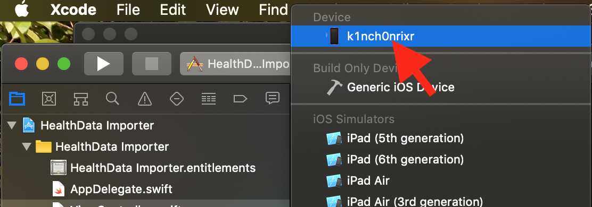

# HealthData-Importer

A Tool to import health data to iOS health kit.

iOS 8.0 later.

You can import iOS health data from export.xml which exported on HealthCare app.

Not correspond to import the following datas.
 - Workout
 - Activity Summary
 - HKQuantityTypeIdentifierAppleExerciseTime
 - HKQuantityTypeIdentifierWalkingHeartRateAverage
 - HKCategoryTypeIdentifierAppleStandHour
 - Some device info
 - ...

my blog page → [iPhone ヘルスケアデータをXMLからインポートする 2018年2月21日水曜日 - 高専の勉強がこんなに難しいわけがない](https://koubenwakenai.blogspot.com/2018/02/iphone-xml.html)

# Environment, Required
 - Mac (required)
 - Xcode 10.2 (earlier may ok...)


# How to use
## Preparation
1. export health data.


1. save zip file on iCloud, or AirDrop to your mac(recommended)
1. Unzip and get `export.xml` (日本語では`書き出したデータ.xml`．名前をexport.xmlに変えておいてください．)

## main
1. clone this project.
1. Open `HealthData Importer.xcodeproj` file.

1. Connect your iPhone to your Mac. Select your iPhone.


1. Run

1. After starting, stop the app
1. Deploy the exported xml file to the app's documents directory. There are 2 ways, via iTunes File Sharing and via iOS's File.app.
1. Run the app again and tap start button.
1. You can see progress on Xcode. In this picture, the app is running on a simulator.


## deploy via iTunes


## deploy via File.app


# trouble shooting
In many cases, I have to fix the source code. Please submit new issue.

## Where can I see progress/log?
You can see it on Right side in Xcode Debug area.
[View] -> [Debug Area] -> [Activate Console]

## [error]: Error Domain=com.apple.healthkit Code=4 "Not authorized" UserInfo={NSLocalizedDescription=Not authorized}
Not authorized some data.

Add some code

```swift
func saveQuantity(type: String, device: String?, unit: String, startDate: String, endDate: String, value: String, metadata: [String : Any]?){
        // 'Authorization to share the following types is disallowed: HKQuantityTypeIdentifierWalkingHeartRateAverage' 等
        guard type != "HKQuantityTypeIdentifierAppleExerciseTime" else { return }
        guard type != "HKQuantityTypeIdentifierWalkingHeartRateAverage" else { return }
        guard type != "HKQuantityTypeIdentifierXXXXXXXXXXXXXXXX" else { return } // <- Add
        
        guard ...
```

or

```swift
func saveCategory(type: String, device: String?, startDate: String, endDate: String, value: String, metadata: [String : Any]?){
        guard type != "HKCategoryTypeIdentifierAppleStandHour" else { return }
        guard type != "HKCategoryTypeIdentifierXXXXXXXXXXXXXXXX" else { return } // <- Add
        guard let categoryType = HKCategoryType.categoryType(forIdentifier: HKCategoryTypeIdentifier(rawValue:type)) else { print("☠️005201 nil type"); return }
        
        /// まとめて保存用処理
```

## *** Terminating app due to uncaught exception '_HKObjectValidationFailureException', reason: 'Invalid class NSTaggedPointerString for metadata key: HKXXXXXXXXX. Expected XXXXXXXX.'
This app has not been able to catch some metadata.

Fix `func loadMetadataEntry(metadata: [String: Any]?) -> [String : Any]?` function.
